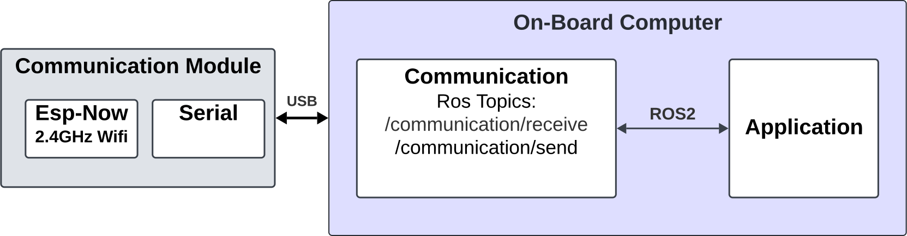

# DroneComms

DroneComms aims to break down the barriers to scalable multi-UAV systems by providing an open-source, low-cost, and plug-and-play solution for decentralized UAV-to-UAV communication. Leveraging the 2.4GHz Wi-Fi spectrum and a connectionless protocol, this project simplifies deployment by enabling UAVs to seamlessly exchange binary data through an ad-hoc network—all while integrating effortlessly with ROS 2. With DroneComms, UAVs can dynamically join or leave operations without centralized control or extensive pre-configuration.

## System Architecture



The diagram above illustrates the ROS 2 nodes implemented in the communication module package and their corresponding topics for interfacing. Key components include:

- **Blue Box:** Nodes running on the UAV’s onboard computer.
- **Gray Box:** ESP32 module running the firmware responsible for communication.

This architecture ensures efficient and dynamic communication across UAVs, supporting flexible mission operations.

## Key Features
- **Decentralized Communication:** No need for centralized infrastructure.
- **Ad-hoc Networking:** UAVs can join or leave the network dynamically.
- **Seamless ROS 2 Integration:** Supports a range of UAV operations through native ROS 2 compatibility.
- **Low-cost Implementation:** Utilizes widely available hardware such as ESP32 modules.

## Submodules

- [Planning Module](./planning/README.md)  
  Contains tools and algorithms for autonomous UAV path planning.

- [Communication Firmware](./communication_firmware/README.md)  
  ESP32 firmware enabling the communication capabilities of the system.


## Citation
If you use DroneComms in your research, please cite as follows:

```bibtex
@inproceedings{grontved2025Communication,
  title={Communication for UAV Swarms: an Open-source, Low-cost Solution Based on ESP-NOW (under review)},
  author={Gr{\u{o}}ntved, Kasper AR and Ladig, Robert and Lyhne Christensen, Anders},
  booktitle={2024 International Conference on Unmanned Aircraft Systems (ICUAS)},
  year={2025},
  note={Under review},
  organization={IEEE}
}
```

## License
This project is licensed under the MIT License. See the [LICENSE](./LICENSE) file for details.

---
Enhancing UAV operations has never been more accessible. Join us in advancing the field of decentralized drone communication with DroneComms.

