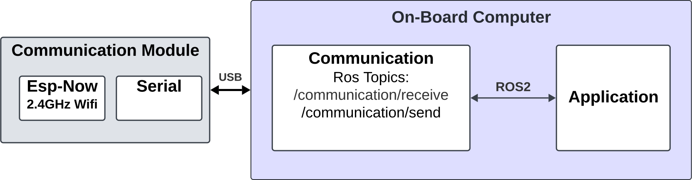

# Communication Driver Node



## Overview
The `CommunicationDriver` node is responsible for handling serial communication between a ROS 2 system and an external device. It reads messages from the serial port, processes them, and publishes them to a ROS topic. It also listens to a ROS topic for messages to send to the serial port.

## Features
- Reads messages from a serial port and publishes them to the `/communication/message` topic.
- Listens to the `/communication/broadcast` topic and sends received messages to the serial port.
- Handles message framing with start and end delimiters and escape characters.

## Parameters
- `port` (string): The serial port to use for communication. Default is `/dev/ttyACM0`.

## Topics
### Published Topics
- `/communication/message` (`common_interface/msg/ByteArray`): Publishes messages received from the serial port.

### Subscribed Topics
- `/communication/broadcast` (`common_interface/msg/ByteArray`): Listens for messages to send to the serial port.

## Usage
1. Ensure the serial device is connected to the specified port.
2. Launch the node:
    ```sh
    ros2 run communication driver
    ```

## Code Structure
- `CommunicationDriver`: Main class handling the serial communication.
- `add_escape_to_message(data)`: Static method to add escape characters to the message.
- `remove_escape_from_message(data)`: Static method to remove escape characters from the message.
- `serial_read_callback()`: Callback method for reading from the serial port.
- `send_message_callback(msg)`: Callback method for sending messages to the serial port.
- `send_message_to_serial(port, data)`: Method to send a message to the serial port.
- `receive_message_from_serial()`: Method to receive a message from the serial port.
